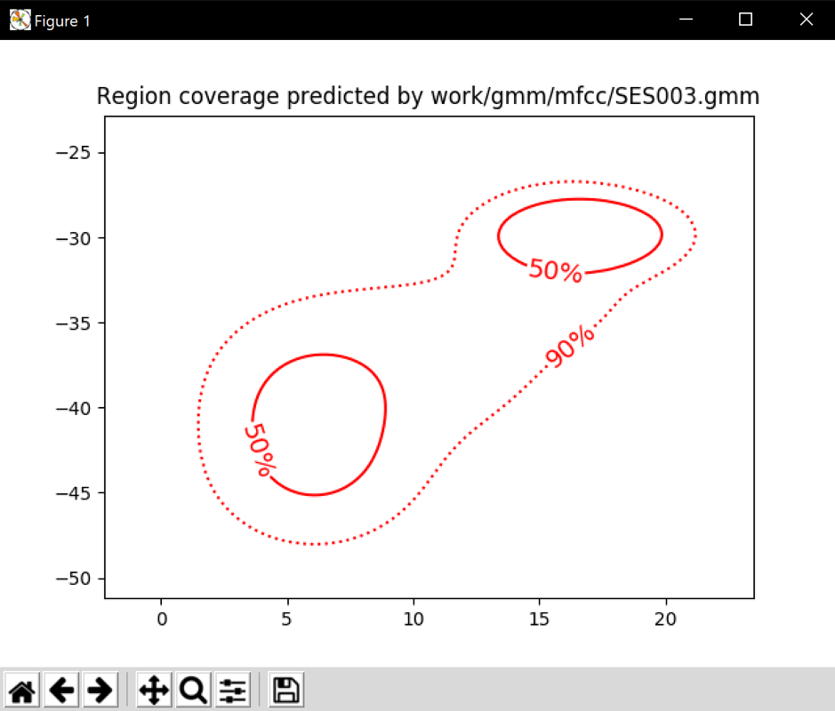

PAV - P4: reconocimiento y verificación del locutor
===================================================

Obtenga su copia del repositorio de la práctica accediendo a [Práctica 4](https://github.com/albino-pav/P4)
y pulsando sobre el botón `Fork` situado en la esquina superior derecha. A continuación, siga las
instrucciones de la [Práctica 3](https://github.com/albino-pav/P3) para crear una rama con el apellido de
los integrantes del grupo de prácticas, dar de alta al resto de integrantes como colaboradores del proyecto
y crear la copias locales del repositorio.

También debe descomprimir, en el directorio `PAV/P4`, el fichero [db_spk.tgz](https://atenea.upc.edu/pluginfile.php/3008277/mod_assign/introattachment/0/db_spk.tgz?forcedownload=1)
con la base de datos oral que se utilizará en la parte experimental de la práctica.

Como entrega deberá realizar un *pull request* con el contenido de su copia del repositorio. Recuerde
que los ficheros entregados deberán estar en condiciones de ser ejecutados con sólo ejecutar:

~~~~~~~~~~~~~~~~~~~~~~~~~~~~~~~~~~~~~~~~~~~~~~~~~~~~~.sh
  make release
  run_spkid mfcc train test classerr verify verifyerr
~~~~~~~~~~~~~~~~~~~~~~~~~~~~~~~~~~~~~~~~~~~~~~~~~~~~~

## Ejercicios.

### Extracción de características.

- Escriba el *pipeline* principal usado para calcular los coeficientes cepstrales de predicción lineal
  (LP), en el fichero <code>scripts/wav2lp.sh</code>:
  
~~~~~~~~~~~~~~~~~~~~~~~~~~~~~~~~~~~~~~~~~~~~~~~~~~~~~~~~~~~~~~~~~~~~~~~~~~~~~~~~~~~~~~~~~~~~~~~~~.sh

sox $inputfile -t raw - | $X2X +sf | $FRAME -l 400 -p 80 | $WINDOW -l 400 -L 400 |
        $LPC -l 400 -m $lpc_order > $base.lp
~~~~~~~~~~~~~~~~~~~~~~~~~~~~~~~~~~~~~~~~~~~~~~~~~~~~~~~~~~~~~~~~~~~~~~~~~~~~~~~~~~~~~~~~~~~~~~~~~

- Escriba el *pipeline* principal usado para calcular los coeficientes cepstrales de predicción lineal
  (LPCC), en su fichero <code>scripts/wav2lpcc.sh</code>:
  
~~~~~~~~~~~~~~~~~~~~~~~~~~~~~~~~~~~~~~~~~~~~~~~~~~~~~~~~~~~~~~~~~~~~~~~~~~~~~~~~~~~~~~~~~~~~~~~~~.sh
sox $inputfile -t raw - dither -p12 | $X2X +sf | $FRAME -l 200 -p 40 | $WINDOW -l 200 | 
        $LPC -l 200 -m $lpc_order | $LPC2C -m $lpc_order -M $nceps > $base.cep
~~~~~~~~~~~~~~~~~~~~~~~~~~~~~~~~~~~~~~~~~~~~~~~~~~~~~~~~~~~~~~~~~~~~~~~~~~~~~~~~~~~~~~~~~~~~~~~~~
  

- Escriba el *pipeline* principal usado para calcular los coeficientes cepstrales en escala Mel (MFCC), en
  su fichero <code>scripts/wav2mfcc.sh</code>:

~~~~~~~~~~~~~~~~~~~~~~~~~~~~~~~~~~~~~~~~~~~~~~~~~~~~~~~~~~~~~~~~~~~~~~~~~~~~~~~~~~~~~~~~~~~~~~~~~.sh
sox $inputfile -t raw - dither -p12 | $X2X +sf | $FRAME -l 200 -p 40 | 
        $MFCC -l 200 -m $mfcc_order -s 8000 -n $ncoef > $base.mfcc
~~~~~~~~~~~~~~~~~~~~~~~~~~~~~~~~~~~~~~~~~~~~~~~~~~~~~~~~~~~~~~~~~~~~~~~~~~~~~~~~~~~~~~~~~~~~~~~~~

- Indique qué parámetros considera adecuados para el cálculo de los coeficientes LPCC y MFCC.

LPCC:
~~~~~~~~~~~~~~~~~~~~~~~~~~~~~~~~~~~~~~~~~~~~~~~~~~~~~~~~~~~~~~~~~~~~~~~~~~~~~~~~~~~~~~~~~~~~~~~~~.sh
EXEC="wav2lpcc 13 10 $db/$filename.wav $w/$FEAT/$filename.$FEAT"
~~~~~~~~~~~~~~~~~~~~~~~~~~~~~~~~~~~~~~~~~~~~~~~~~~~~~~~~~~~~~~~~~~~~~~~~~~~~~~~~~~~~~~~~~~~~~~~~~

Hemos decidido por prueva i error consiguiendo un aceptable error_rate un orden de lpc de 13 i el número de cepstrums = 10. Por otro lado, para el cálculo de los coeficientes

MFCC:
~~~~~~~~~~~~~~~~~~~~~~~~~~~~~~~~~~~~~~~~~~~~~~~~~~~~~~~~~~~~~~~~~~~~~~~~~~~~~~~~~~~~~~~~~~~~~~~~~.sh
EXEC="wav2mfcc 13 14 $db/$filename.wav $w/$FEAT/$filename.$FEAT"
~~~~~~~~~~~~~~~~~~~~~~~~~~~~~~~~~~~~~~~~~~~~~~~~~~~~~~~~~~~~~~~~~~~~~~~~~~~~~~~~~~~~~~~~~~~~~~~~~

En este caso usamos un orden de mfcc de 13 por ser de forma generalizada óptimo y 14 coefs. También por prueba y error, obtenemos un error_rate de 11%. Bastante buen resultado.

- Inserte una imagen mostrando la dependencia entre los coeficientes 2 y 3 de las tres parametrizaciones
  para una señal de prueba.
  
  Parametrización LP
  
  
  
  Parametrización MFCC
  
  
  
  Parametrización LPCC
  
  
  
  + ¿Cuál de ellas le parece que contiene más información?
  
  
La representación del mel-cepstrum és la que muestra la información más completa, debito a que este oncentra la información del trozo de señal analizado en un numero reducido de muestras y tiene coeficientes más incorrelados que en los demas casos. Por lo tanto,en el momento de la clasificación habrá menos redundancia. 
  
### Entrenamiento y visualización de los GMM.

- Inserte una gráfica que muestre la función de densidad de probabilidad modelada por el GMM de un locutor
  para sus dos primeros coeficientes de MFCC.
  
  
  
- Inserte una gráfica que permita comparar los modelos y poblaciones de dos locutores distintos. Comente el
  resultado obtenido y discuta si el modelado mediante GMM permite diferenciar las señales de uno y otro.
  
  
  
La imagen corresponde a la GMM obtenida de un locutor distinto de la pregunta anterior. Como podemos ver si comparamos las dos gráficas se diferencian en la probabilidad de decisión. La salida se representa con las direcciones de máxima varianza. Una vez obtenidas las características se hace la parametrización a partir de las fdp gaussianas.

### Reconocimiento del locutor.

- Inserte una tabla con la tasa de error obtenida en el reconocimiento de los locutores de la base de datos
  SPEECON usando su mejor sistema de reconocimiento para los parámetros LP, LPCC y MFCC.
  
  |                 | LP   | LPCC | MFCC |
   |------------------|:----:|:----:|:----:|
   | COSTDETECT       |95% |  | 90.8% |
    | MISSED       |238/250 |  | 227/250 |

### Verificación del locutor.

- Inserte una tabla con el *score* obtenido con su mejor sistema de verificación del locutor en la tarea
  de verificación de SPEECON. La tabla debe incluir el umbral óptimo, el número de falsas alarmas y de
  pérdidas, y el score obtenido usando la parametrización que mejor resultado le hubiera dado en la tarea
  de reconocimiento.
  
  |                 | LP   | LPCC | MFCC |
  |------------------|:----:|:----:|:----:|
  | ERROR_RATE      |15.92%|82.29|11.72%|
 
### Test final y trabajo de ampliación.

- Recuerde adjuntar los ficheros `class_test.log` y `verif_test.log` correspondientes a la evaluación
  *ciega* final.

- Recuerde, también, enviar a Atenea un fichero en formato zip o tgz con la memoria con el trabajo
  realizado como ampliación, así como los ficheros `class_ampl.log` y/o `verif_ampl.log`, obtenidos como
  resultado del mismo.
